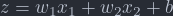

# Table of Contents

1.  [Pseudo-code](#org7cd6254)
    1.  [Matrix transpose](#orga188f7c)
    2.  [Matrix Multiplication](#org6002ed5)
2.  [Blobs](#org310a16f)
    1.  [Objective](#orgb21fdee)
3.  [Perceptron](#org5077bdb)
    1.  [Linear function](#org9c53af7)
    2.  [Sigmoid function](#org3802c67)
    3.  [Bernoulli](#org306237f)
4.  [Graphic](#org18c2d7c)
    1.  [Overview](#orgae0887a)
    2.  [Neuron Network](#orged5c367)
    3.  [Log Loss Convergence](#orgfc5616b)
5.  [Cost function](#org18e75c5)
    1.  [Likelihood (*Vraisemblance*)](#orgf392c87)
    2.  [Loss function (Log Loss)](#orgf6df4df)
    3.  [Log Likelihood](#orgdb114da)
    4.  [Result](#org0a4e532)
6.  [Gradient descent](#orgdd0483f)
    1.  [Gradient descent algorithm](#org50a2ee8)
    2.  [Decomposition](#orgbf797d4)
    3.  [Calculation of $\frac{\delta \mathcal{L}}{\delta a}$](#org2b3718f)
    4.  [Calculation of $\frac{\delta a}{\delta z}$](#orgdb206ad)
    5.  [Calculation of $\frac{\delta z}{\delta w_1}$](#org3dc36f0)
    6.  [Calculation of $\frac{\delta z}{\delta w_2}$](#org0a84c9e)
    7.  [Calculation of $\frac{\delta z}{\delta b}$](#org02da616)
    8.  [Conclusion for $\frac{\delta \mathcal{L}}{\delta w_1}$](#org0b90d73)
    9.  [Conclusion for $\frac{\delta \mathcal{L}}{\delta w_2}$](#org6987717)
    10. [Conclusion for $\frac{\delta \mathcal{L}}{\delta b}$](#org160f09e)
    11. [Conclusion](#orga25525d)
7.  [Vector](#orga8fe287)
    1.  [Introduction](#org36739f2)
    2.  [Dataset](#org64c81df)
    3.  [Vectorization of A](#org2327933)
    4.  [Cost function Vectorization](#org0e554bb)
    5.  [Gradient descent Vectorization](#orge2bc3a5)
    6.  [Gradient Vectorization](#orgb51bda0)
8.  [Algorithm](#orgd709270)
    1.  [Overview](#org942cd83)
    2.  [Algorithme](#org2c887d0)

# Pseudo-code

## Matrix transpose

    Function transpose_matrix(M):
        m = number of rows in M
        n = number of columns in M
        T = empty matrix
    
        For j from 0 to n-1:
            Initialize row as an empty list
            For i from 0 to m-1:
                Append M[i][j] to row
            Append row to T
    
        Return T

## Matrix Multiplication

    Function multiply-matrices(matrix1, matrix2):
        m = number of rows in matrix1
        n = number of columns in matrix1
        p = number of columns in matrix2
    
        If n ≠ number of rows in matrix2:
            Return "Error: incompatible dimensions"
    
        Initialize result as an empty list
    
        For i from 0 to m-1:
            Initialize row as an empty list
            For j from 0 to p-1:
                sum = 0
                For k from 0 to n-1:
                    sum = sum + matrix1[i][k] * matrix2[k][j]
                Append sum to row
            Append row to result
    
        Return result

# Blobs

## Objective

Build a data set with:

-   X: 2D points (or N dimensions)
-   y: cluster label

Each cluster is centralize around one center with gaussian noise.
Just a simple example

# Perceptron

## Linear function

## Sigmoid function

## Bernoulli

# Graphic

## Overview

## Neuron Network

## Log Loss Convergence

# Cost function

## Likelihood (*Vraisemblance*)

## Loss function (Log Loss)

## Log Likelihood

## Result

# Gradient descent

This involves adjusting the parameters \textbf{W} and \textbf{b} in order to minimize model errors, i.e., to minimize the \textbf{cost function} (Log Loss).  
That is why we calculate the gradient (or derivative) of the \textbf{cost function}.

## Gradient descent algorithm

## Decomposition

## Calculation of $\frac{\delta \mathcal{L}}{\delta a}$

## Calculation of $\frac{\delta a}{\delta z}$

Let us choose $h=g \circ f$ with $f(z) = 1+e^{-z}$ and $g(f(z))=\frac{1}{f(z)}$, i.e.

In conclusion, we obtain

## Calculation of $\frac{\delta z}{\delta w_1}$

## Calculation of $\frac{\delta z}{\delta w_2}$

## Calculation of $\frac{\delta z}{\delta b}$

## Conclusion for $\frac{\delta \mathcal{L}}{\delta w_1}$

## Conclusion for $\frac{\delta \mathcal{L}}{\delta w_2}$

## Conclusion for $\frac{\delta \mathcal{L}}{\delta b}$

## Conclusion

For our gradient descent

we obtain the following gradients:

That mean:

# Vector

## Introduction

In mathematics and programming, a column vector is usually represented as a vertical list of elements, enclosed in square brackets or parentheses. In Lisp (and more specifically in Common Lisp), there is no native data type for column vectors as in mathematics or NumPy. However, you can represent a column vector as a simple list, where each element corresponds to a component of the vector.

## Dataset

Let&rsquo;s take the case of a dataset containing m data points, each of which consists of n parameters (variables).

and

as well as

For $n=2$, we therefore find that

or

## Vectorization of A

Reminder

So, we have

## Cost function Vectorization

The objective is to compare vector $A$ with vector $y$.

## Gradient descent Vectorization

Remind

So, we can write

Mathematically, we should rather write  $W_{t+1} = W_t - \alpha \frac{\delta \mathcal{L}} {\delta W}$

## Gradient Vectorization

and

# Algorithm

## Overview

## Algorithme

